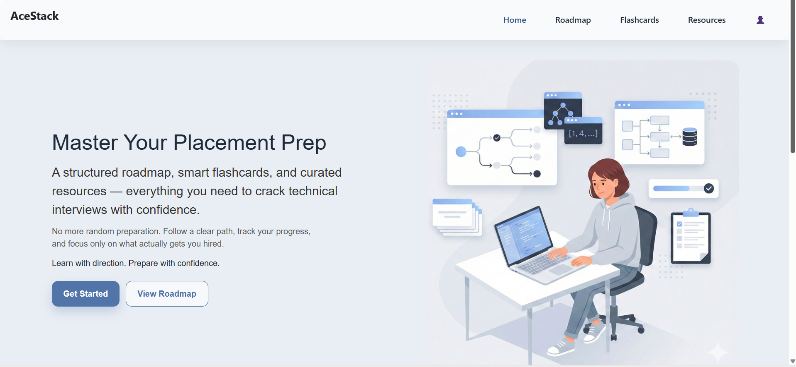

🚀 AceStack — Placement Prep Platform

AceStack is a structured placement preparation platform designed to help students prepare efficiently for technical interviews.

It provides a clear roadmap, smart revision tools, and curated resources — all in one place.

✨ Features

📌 Structured Roadmaps
Step-by-step guidance for DSA and core CS subjects.

🧠 Smart Flashcards
Covers OOPs, Operating Systems, DBMS, and Computer Networks for quick revision.

📚 Curated Resources
Handpicked notes, articles, and trusted external learning links.

🔐 User Authentication
Secure login/signup using Firebase Authentication.

👤 User Profiles
Save personal and educational details using Firestore.

🎨 Responsive UI
Built with reusable React components for a clean, modern interface.

🛠 Tech Stack

Frontend: React.js

Routing: React Router

Authentication: Firebase Auth

Database: Firebase Firestore

Styling: Custom CSS

📷 Preview
